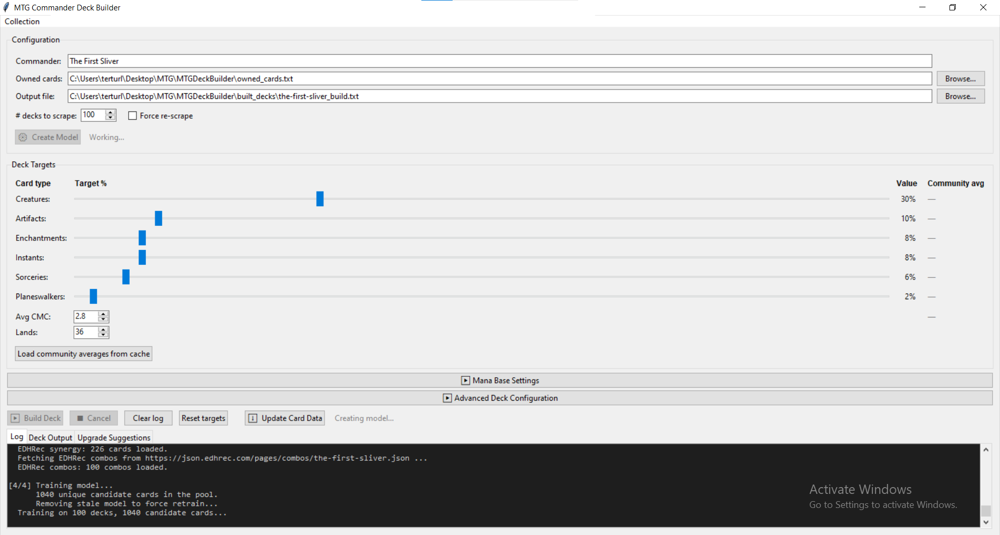

# MTG Commander Deck Builder

Builds the best Commander deck from the cards you already own. Point it at your collection, pick a commander, and it uses machine learning trained on real community decks to recommend the strongest 99-card list from what you have.

## Originally posted on r/EDH

I just wanna give a huge thanks for the input i got from the community! Next steps will be helping with importing cards from other websites rather than decks. Hopefully make a way to sync your cards to these websites eith frequent pulling so you dont have to add in multiple different places!

---



## Getting Started

Download the latest release from the [Releases](../../releases) page and double-click `MTGDeckBuilder.exe` to run. No Python or installation required.

> **First launch is slow.** The executable unpacks itself on startup — expect 15–30 seconds before the window appears. Subsequent launches are faster.

---

## Building Your First Deck

Follow these steps in order the first time you use the app.

### 1. Update Card Data
Click **⬇ Update Card Data** before doing anything else. This downloads the full Scryfall card database and keyword files (~300 MB) and builds the feature set used by the model. You only need to do this once, or again when a new MTG set releases.

### 2. Enter Your Commander
Type a commander name into the **Commander** field at the top.

> **The first time you type, the app will pause for a few seconds** while it loads the card libraries into memory. After that initial load it responds instantly.

### 3. Load Your Collection
Make sure the **Owned cards** field points to your collection file — a plain text file with one card name per line. Quantities are optional:
```
Sol Ring
1 Command Tower
4x Lightning Bolt
// This is a comment and will be ignored
```

### 4. Create Model
Click **Create Model**. This scrapes 100 community decks for your commander from MTGGoldfish and trains a card-inclusion model on them. The status label will turn green when it's ready.

This step takes several minutes depending on your connection speed. You only need to redo it if you want to refresh the community data or switch commanders.

### 5. Tweak the Deck Targets *(optional)*
The **Deck Targets** sliders let you adjust what kind of deck gets built — more creatures, lower curve, etc. Click **Load community averages from cache** to pre-fill the sliders with what real community decks look like for your commander, then adjust from there.

### 6. Build Deck
Click **Build Deck**. The builder will:
- Score every card you own against the model
- Greedily fill non-land slots toward your target curve
- Use NLP similarity search to find owned replacements for any missing cards
- Construct a proportional mana base from your owned lands

Progress is shown in the **Log** tab. When it finishes, the app switches to the **Deck Output** tab automatically.

### 7. Review the Output
The **Deck Output** tab shows the full 99-card list, along with a **collection coverage summary** — how many cards were picked directly, how many were NLP-matched from your collection, and how many are basic lands.

Use **Copy to clipboard** to paste straight into Moxfield, Archidekt, or any other deckbuilder.
---

## Tips

- **Switching commanders?** Just type a new name and click Create Model. Each commander gets its own cached model so switching back is instant.
- **New cards in your collection?** Update your owned cards file and click Build Deck again — no need to recreate the model.
- **New MTG set released?** Click Update Card Data, then Create Model to retrain on the latest cards.
- **Force a fresh scrape** of community decks by checking **Force re-scrape** before clicking Create Model.
